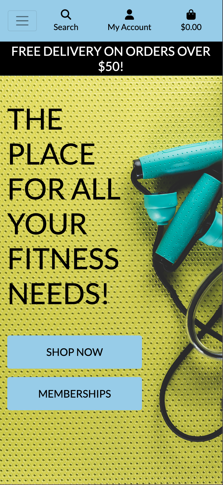
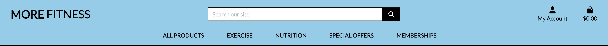
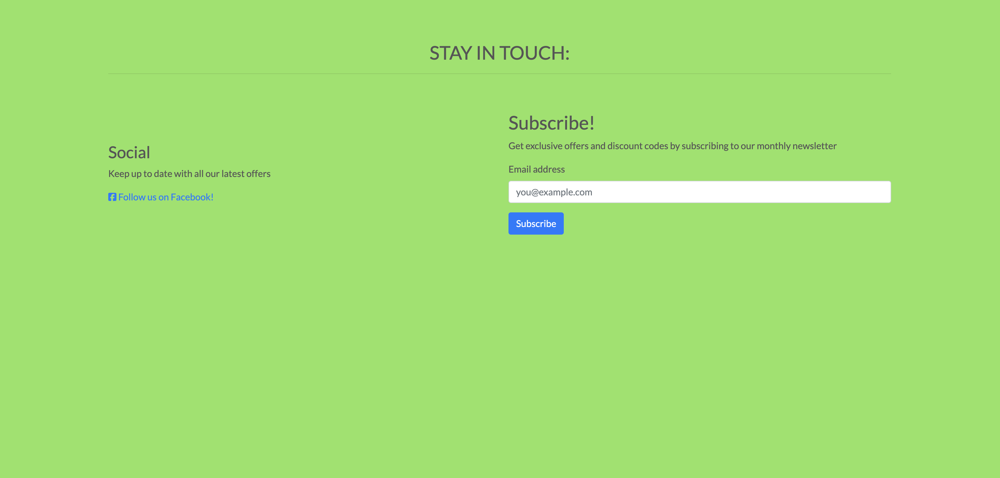
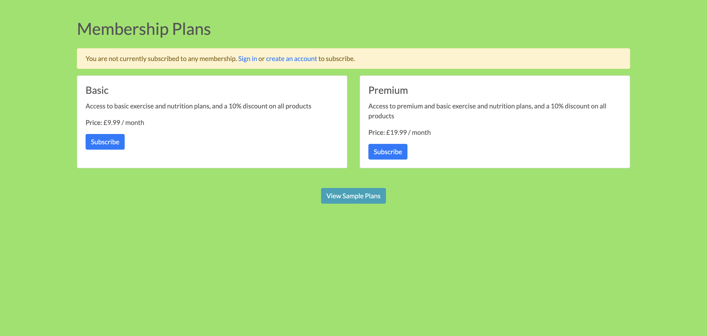
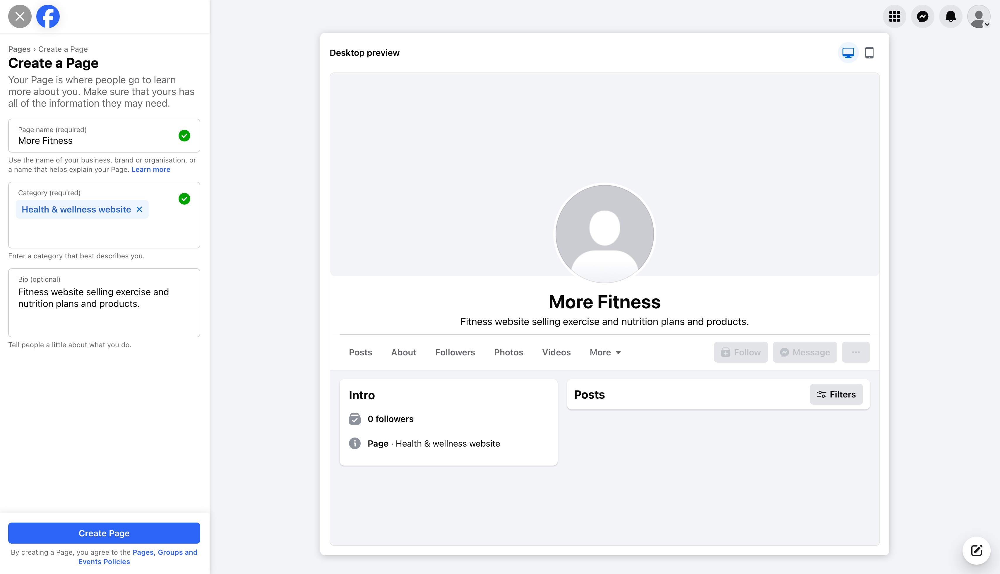
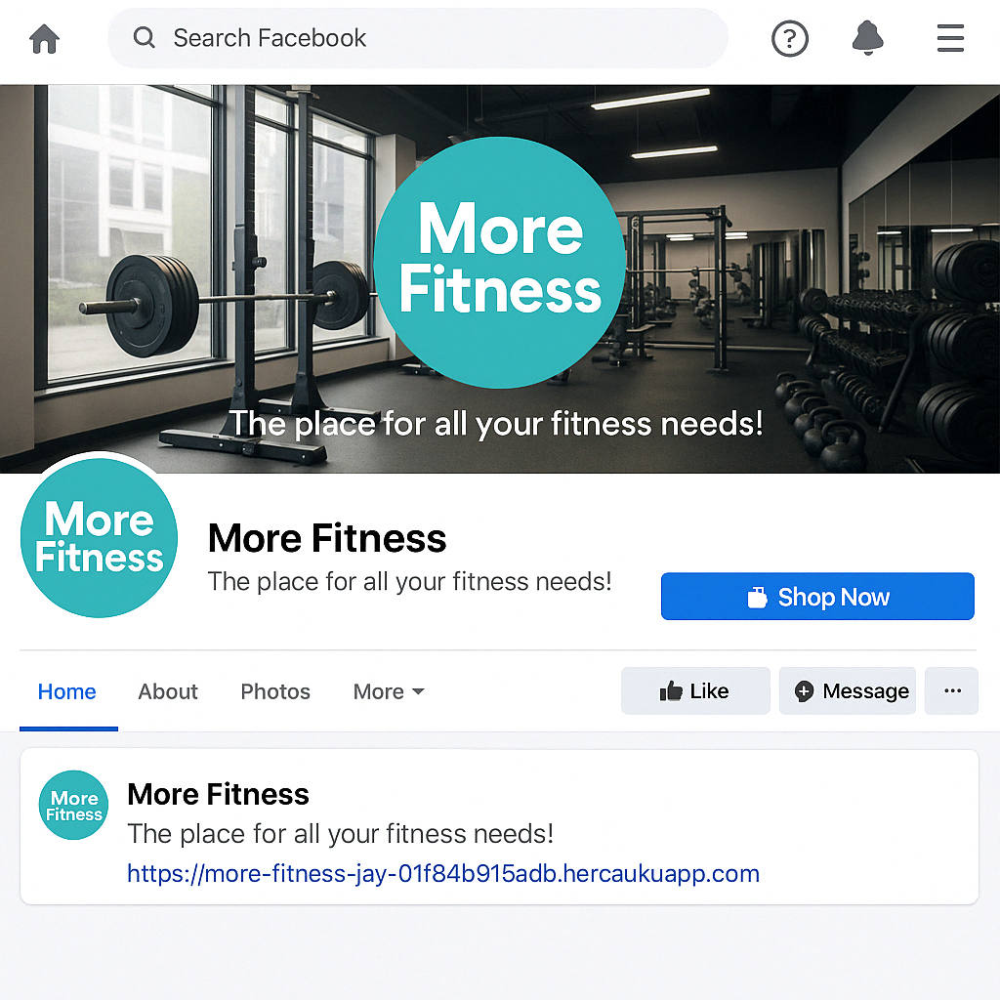
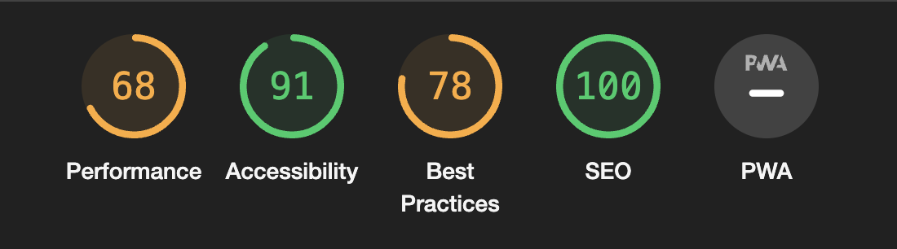

# More Fitness

More fitness is a site that aims to provide users with an online store of health and fitness related products to purchase, as well as memberships which give users access to monthly exercise and nutrition plans to follow.
The site also gives users the opportunity to subscribe to a monthly newsletter about fitness related issues.
The site is targeted towards people who have an interest in fitness and health.
It will be userful to users by providing them with the chance to purchase the memberships, allowing them access to exercise and nutrition plans to help them reach their goals, and also by providing access to purchasing fitness related products.
Below are screenshots taken with the homepage on large, medium and small screens.

## Features 

### Existing Features

- __Navigation Bar__

  - Featured on all pages of the site, the fully responsive navigation bar includes links to the products page, as well as links to pages for specific categories of products, and links to membership pages as well. It is identical in each page to allow for easy navigation.
  - It also features a search bar where users can search for specific parts of the site, and a link in the corner for users to view their account details, login or logout, and a link to view their current shopping bag.
  - This section will allow the user to easily navigate from page to page across all devices without having to revert back to the previous page via the ‘back’ button.

- __The Homepage Background Image__

  - The homepage includes a background image of health and fitness related items to grab users attention and draw them to the topic of the site straight away.
  - This section introduces the user to More Fitness with a memorable image.

- __The Homepage Text__

  - The text on the homepage says 'the place for all your fitness needs'.
  - The buttons beneath the text give users the option to either go straight to the shopping for products part of the site, or to have a look at the memberships section.
  - The membership button says 'Memberships' or 'My Membership' depending on whether the user is logged in or not.
  - The buttons are coloured to match the navbar, and the general colour theme of the homepage is bright to create a healthy feel.

- __The Sign Up / Newsletter Page__

  - This page will allow the user to subscribe to a More Fitness newsletter. The user will be asked to submit their email address to subscribe.

- __The Membership Page__

  - This page will allow users to view current state of their membership.
  - If a user is logged out, the page will display the available membership plans, and a button to view sample exercise and nutrition plans.
  - If a user is pgged in, the page will display whether or not the user is subscribed to a membership, and buttons to take the user to their exercise and nutrition plans if they are subscribed.
  - If the user is not subscribed, these buttons will take them to an access denied page.

### Features To Implement In Future

- One feature that would be implemented in future would be for users who have a registered account to be able to post comments on the products and memberships to give other users a good idea of how good the products and memberships are.
- A news page, containing the latest articles and news updates from the world of health and fitness.
- A third membership tier with even more on offer.
- Actual content for the exercise and nutrition plans when the user clicks the 'view details' button on an individual plan.
- A real life Facebook business page. This would be the page users are taken to whewn they click the 'follow us on facebook' link on the subscribe to newsletter page. I attempted to create a real one but facebook wouldn't allow me, so below is a screenshot of the attempted page on Facebook, and a mockup image of what the real page might look like.

### Other Future Changes

- Change the styling of the buttons on the login, logout and signup pages to match the buttons in the memberships area of the site.
- Add more products to each category in the shop section of the site.

## Testing

- I tested that this page works in different browsers, Chrome and Safari.
- I confirmed that this project is responsive, looks good and functions on all standard screen sizes using the devtools device toolbar.
- I confirmed that the navigation, header, signup/newsletter page, memberships page, product pages and form input fields are all readable and easy to understand.
- I have confirmed that the checkout flow works, users can add an item to their bag, then select the go to checkout button, then secure checkout, then they add their details for the order and confirm, and are taken to an order confirmation page afterwards.
- I have confirmed that the membership flow works, users can visit the membership page, which will display differently according to whether they are logged in or out, and also whether they are currently subscribed to a membership. If logged in and subscribed, they can view their exercise and nutrition plans and the details of each plan as well. If not subscribed, they can view sample plans.

### Validator Testing 

- HTML
  - A few minor errors were returned when passing some HTML files through the official W3C HTML validator.
- CSS
  - No errors were found when passing through the official W3C Jigsaw CSS validator.
- Accessibility
  - I confirmed that the colours and fonts chosen are easy to read and accessible by running it through lighthouse in devtools.

### Unfixed Bugs

The only unfixed bug is that when a user clicks the subscribe button for the newsletter, a new tab opens with a subscription success confirmation from mailchimp, and a button to take the user back to the site, but when that button is clicked it doesn't take the user back to the site. I was unable to workout how to enter my site url into mailchimp to be used as the redirect site for the button.

## Deployment

- This site was deployed via heroku.

## Credits 

### Content 

- I used the Code Institute 'Boutique Ado' walkthrough project as a guide to initially set up the layout of the site, and the products part of the site, before setting up the memberships part. The products and checkout flow was set up using the 'Boutique Ado' setup.

### Media

- The images were taken from google images.