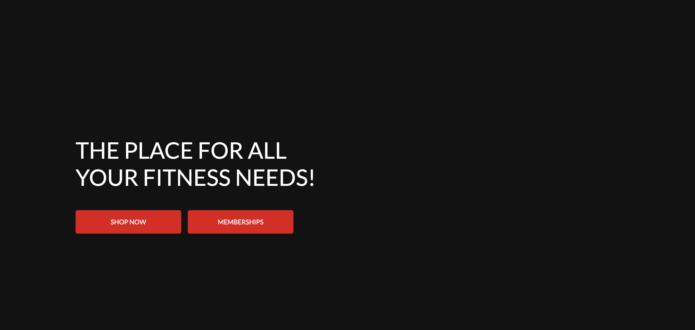

# More Fitness

**More Fitness** is a fitness-focused website offering users an online store for health and fitness-related products, as well as memberships granting access to monthly exercise and nutrition plans. The platform allows users to subscribe to a monthly newsletter and provides a seamless e-commerce experience for purchasing products and subscribing to fitness plans.

The site is designed for fitness enthusiasts and health-conscious individuals who are looking for tools, products, and content to help them reach their fitness goals.

## Table of Contents
- [Project Overview](#project-overview)
- [Wireframes](#wireframes)
- [Features](#features)
  - [Existing Features](#existing-features)
  - [Future Features](#features-to-implement-in-future)
- [E-commerce Business Model](#e-commerce-business-model)
- [Installation](#installation)
  - [Prerequisites](#prerequisites)
  - [Deploying to Heroku](#deploying-to-heroku)
- [Testing](#testing)
  - [Manual Testing](#manual-testing)
  - [Validator Testing](#validator-testing)
- [Deployment](#deployment)
- [Security Features](#security-features)
- [Credits](#credits)
  - [Content](#content)
  - [Media](#media)
  - [Acknowledgements](#acknowledgements)

## Project Overview

The purpose of the More Fitness site is to provide the fitness community with an online store where they can purchase fitness-related products and subscribe to exercise and nutrition plans. These memberships give users access to fitness plans that help them meet their fitness goals, and they can also purchase physical products to enhance their fitness journey.

## Wireframes/Design Mockups

- Homepage (desktop view)

- Homepage (mobile view)

- Products Page (desktop view)

- Products Page (mobile view)

- Memberships Page (desktop view)

- Memberships Page (mobile view)

### Key Features:
- **User Registration & Authentication**: Users can create an account, log in, and log out.
- **Subscription & Membership**: Users can subscribe to various membership plans (monthly) for access to exercise and nutrition plans.
- **E-commerce Store**: Users can browse, filter, and purchase fitness-related products.
- **Newsletter Subscription**: Users can sign up for a fitness newsletter.
- **Admin Panel**: Admins can manage user data, products, and subscriptions.
- **Stripe Integration**: For handling secure payments and subscriptions.

## Features 

### Existing Features

- __Navigation Bar__

  - Featured on all pages of the site, the fully responsive navigation bar includes links to the products page, as well as links to pages for specific categories of products, and links to membership pages as well. It is identical in each page to allow for easy navigation.
  - It also features a search bar where users can search for specific parts of the site, and a link in the corner for users to view their account details, login or logout, and a link to view their current shopping bag.
  - This section will allow the user to easily navigate from page to page across all devices without having to revert back to the previous page via the ‘back’ button.

- __The Homepage Background Image__

  - The homepage includes a background image of health and fitness related items to grab users attention and draw them to the topic of the site straight away.
  - This section introduces the user to More Fitness with a memorable image.

- __The Homepage Text__

  - The text on the homepage says 'the place for all your fitness needs'.
  - The buttons beneath the text give users the option to either go straight to the shopping for products part of the site, or to have a look at the memberships section.
  - The membership button says 'Memberships' or 'My Membership' depending on whether the user is logged in or not.
  - The buttons are coloured to match the navbar, and the general colour theme of the homepage is bright to create a healthy feel.

- __The Sign Up / Newsletter Page__

  - This page will allow the user to subscribe to a More Fitness newsletter. The user will be asked to submit their email address to subscribe.

- __The Membership Page__

  - This page will allow users to view the current state of their membership.
  - If a user is logged out, the page will display the available membership plans, and a button to view sample exercise and nutrition plans.
  - If a user is pgged in, the page will display whether or not the user is subscribed to a membership, and buttons to take the user to their exercise and nutrition plans if they are subscribed.
  - If the user is not subscribed, these buttons will take them to an access denied page.

- __The Membership Benefits Page__

  - This page allows users to view the details and benefits of each membership.

- __The Products Page__

  - This page allows users to view all products available in the online store.
  - It has a dropdown box available for users to filter the products by category, price, name and rating.
  - Users can click on each nindividual product to view a product detail page.

### Features To Implement In Future

- **User Reviews**: Allow registered users to post reviews and comments on products and memberships.
- **News Page**: A news section for the latest fitness articles and updates.
- **Additional Membership Tier**: Introduce a higher-level membership tier with more benefits.
- **Content for Plans**: Include detailed content for each exercise and nutrition plan when users click "View Details".
- **Facebook Page**: Implement a real Facebook business page for users to follow via the newsletter page.

### Other Future Changes

- Change the styling of the buttons on the login, logout and signup pages to match the buttons in the memberships area of the site.
- Add more products to each category in the shop section of the site.

## E-commerce Business Model

The **business model** behind the More Fitness site is based on **subscription-based access** to fitness content and a traditional **e-commerce store** for physical products.

### Subscription Model:
- **Membership Tiers**: Users can subscribe to different tiers of memberships, including a free and one or more paid tiers.
  - The free tier gives access to basic content, while paid tiers unlock premium fitness plans.
  - Monthly payments are processed using **Stripe** to handle secure transactions.

### E-commerce Model:
- **Products**: The e-commerce part of the site features various fitness-related products (e.g., equipment, accessories, supplements), available for one-time purchase.
- **Product Filtering**: Users can filter products by category, price, rating, etc., making the browsing experience user-friendly.

## Installation

### Prerequisites

- Python 3.x
- Django
- Stripe API keys (for handling payments)
- PostgreSQL (local or AWS RDS database)
- Heroku account for deployment

### Deploying To Heroku

- Create a new heroku app
- Connect the app to Github repository
- Enable automatic deploys
- Set environment variables in heroku config vars
- Set debug to false and push all changes
- Deploy app and open

## Testing

### Manual Testing

- I tested that this page works in different browsers, Chrome and Safari.
- I confirmed that this project is responsive, looks good and functions on all standard screen sizes using the devtools device toolbar.
- I confirmed that the navigation, header, signup/newsletter page, memberships page, product pages and form input fields are all readable and easy to understand.
- I have confirmed that the profile setup works, users can create a profile and successfully log in and out, and can view and edit their profile information and see their order history.

- I have confirmed that the checkout flow works, users can add an item to their bag, then select the go to checkout button, then secure checkout, then they add their details for the order and confirm, and are taken to an order confirmation page afterwards.

- I have confirmed that the membership flow works, users can visit the membership page, which will display differently according to whether they are logged in or out, and also whether they are currently subscribed to a membership. If logged in and subscribed, they can view their exercise and nutrition plans and the details of each plan as well. If not subscribed, they can view sample plans.

- Payments were tested to ensure successful transactions and confirmation emails.

### Validator Testing 

- HTML
  - A few minor errors were returned when passing some HTML files through the official W3C HTML validator. These errors were all caused by the validator's inability to interpret Django template language, e.g. 'Error: Bad value  for attribute href on element a: Illegal character in path segment: { is not allowed.' - From line 30 in subscription_success.html.
- CSS
  - No errors were found when passing CSS files through the official W3C Jigsaw CSS validator.
- Accessibility
  - I confirmed that the colours and fonts chosen are easy to read and accessible by running it through lighthouse in devtools.

### Unfixed Bugs

The only unfixed bug is that when a user clicks the subscribe button for the newsletter, a new tab opens with a subscription success confirmation from mailchimp, and a button to take the user back to the site, but when that button is clicked it doesn't take the user back to the site. I was unable to workout how to enter my site url into mailchimp to be used as the redirect site for the button.

## Deployment

- This site was deployed via heroku.

## Security Features

- Password Hashing: Passwords are securely hashed using Django’s default password hashing mechanisms (bcrypt).
- Session Management: The app uses Django's built-in session management to securely store user sessions and manage user authentication.
- Secret Key: The secret key is stored securely in the environment and never exposed in the codebase.

## Credits 

### Content 

- The site structure and initial product pages were inspired by the Code Institute "Boutique Ado" walkthrough project. The checkout flow and product setup were based on this guide.

### Media

- All images were sourced from Google Images.
- Amazon Web Services (AWS) is used to host static and media files for the project.

### Acknowledgements

- I would like to thank Stripe for their payment API integration documentation.
- Special thanks to the Code Institute for the resources and walkthroughs that helped guide the development of this project.